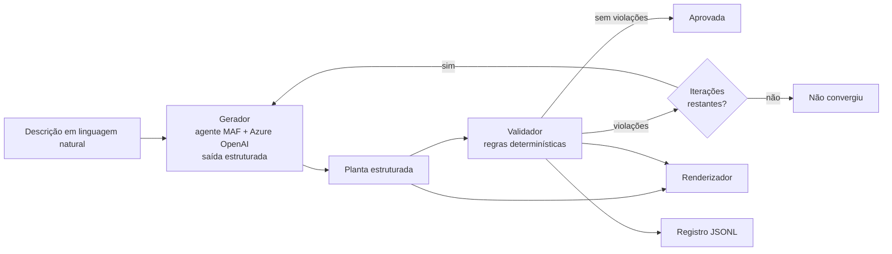

# floorplan-guardrails

A language model proposes the floor plan of a house from a description written in
plain Portuguese. A deterministic validator measures that proposal against design
rules and reports what is wrong. The report goes back to the model, which redraws
the plan, until it passes. The thesis is the separation: **generate with a model,
verify with code.**

[](https://github.com/yujikunitake/floorplan-guardrails/actions/workflows/lint.yml)
[](https://github.com/yujikunitake/floorplan-guardrails/actions/workflows/test.yml)
[](https://github.com/yujikunitake/floorplan-guardrails/releases)
[](LICENSE)

[](https://codespaces.new/yujikunitake/floorplan-guardrails)

## Propósito

Modelos de linguagem produzem respostas plausíveis, e plausível não é correto.
Quando a correção pode ser definida em código, ela não precisa ser aceita por
confiança: pode ser medida, e a medição pode voltar ao modelo como instrução.

A oficina demonstra esse argumento num caso em que a correção é inequívoca. Uma
planta ou tem cômodos sobrepostos, ou não tem; uma janela ou está sobre parede
externa, ou não está. Ao final, espera-se que o participante saiba distinguir o
que convém delegar a um modelo do que convém especificar em código, e reconheça
esse desenho — gerar, verificar, devolver a verificação — como padrão aplicável
muito além de plantas baixas.

## A oficina

Projeto de extensão da PUCPR realizado na Estácio, em setembro de 2026, em
encontro presencial de duas horas. O botão acima abre o ambiente no navegador;
não há instalação.

São três níveis, no mesmo notebook. No primeiro, o participante descreve uma casa
em português e observa o laço operar. No segundo, usa descrições preparadas para
falhar — um quarto pequeno demais, um banheiro sem janela, um cômodo sem porta —
e lê o relatório de violações, que é o que interessa. No terceiro, altera um valor
em `config/rules.yaml` e repete a execução, constatando que quem define o
aceitável é o arquivo de regras, não o modelo.

## Como funciona



Uma peça generativa e quatro determinísticas. O laço permanece em Python comum,
fora do framework de agentes, para que fique visível onde termina a parte que
estima e começa a parte que verifica.

O gerador desconhece os valores das regras: suas instruções tratam apenas de
convenções de desenho, e a área mínima de um quarto jamais lhe é informada. Ele a
descobre lendo o relatório. A restrição é deliberada — sem ela a primeira planta
seria aprovada e não haveria o que demonstrar — e um teste falha caso qualquer
valor de `config/rules.yaml` alcance o prompt.

Em avaliação com 21 descrições, 17 convergiram em até quatro iterações e 14
apresentaram geometria correta já na primeira tentativa; o que limita o modelo é o
tamanho da casa, não a clareza do pedido ([relatório](docs/avaliacao.md)).

## Escopo e limites

Casas térreas, cômodos retangulares alinhados aos eixos, portas e janelas, até
cerca de dez cômodos. Fora do escopo: mais de um pavimento, estrutura, escadas,
mobiliário, orientação solar, recuos do lote e desenho técnico executivo.

Os valores normativos são **provisórios** — cada regra traz `source: "PROVISÓRIO:
a confirmar na Etapa 1"` e ainda não foi conferida contra o código de obras. O
cálculo de ventilação é uma **simplificação**: área da janela multiplicada por um
fator de abertura configurável, 0,50 por padrão.

Material didático. **Não substitui projeto de profissional habilitado.**

## Desenvolvimento

```bash
uv sync --frozen
uv run ruff check && uv run ruff format --check
uv run pytest
```

Nenhum teste comunica-se com o modelo. A camada determinística é exercitada com
plantas construídas manualmente — uma correta e uma por regra violada
isoladamente, incluindo uma casa em L para a detecção de parede externa — e o laço
roda contra um gerador simulado.

Para as chamadas ao Azure, copie `.env.example` para `.env`. A variável
`AZURE_OPENAI_API_VERSION` **não deve ser definida**: o caminho `/openai/v1`
recusa esse parâmetro. A avaliação roda com `uv run python -m eval.run`, e
`--limit` permite conferir antes da rodada completa.

Toda alteração entra por pull request com squash merge; a `main` não aceita push
direto. O título do pull request vira a mensagem do commit e segue Conventional
Commits com lista fechada de escopos, verificada na integração contínua.
