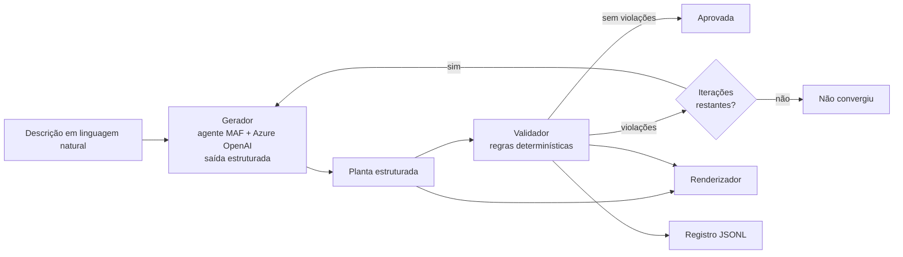

# floorplan-guardrails

A language model proposes the floor plan of a house from a description written in
plain Portuguese. A deterministic validator — plain Python, no geometry or graph
library — measures that proposal against design rules and writes a report of
everything that is wrong. The report goes back to the model, which redraws the
whole plan, and the cycle repeats until it passes or the iteration budget runs
out. The thesis is the separation: **generate with a model, verify with code.**

[](https://github.com/yujikunitake/floorplan-guardrails/actions/workflows/lint.yml)
[](https://github.com/yujikunitake/floorplan-guardrails/actions/workflows/test.yml)
[](https://github.com/yujikunitake/floorplan-guardrails/releases)
[](LICENSE)

[](https://codespaces.new/yujikunitake/floorplan-guardrails)

## A oficina

Material de uma oficina presencial de duas horas, projeto de extensão da PUCPR
realizado na Estácio, em setembro de 2026. O botão acima é o passo 1: ele abre o
ambiente pronto no navegador, sem instalar nada.

A oficina tem três níveis, todos no mesmo notebook:

1. **Descrever uma casa** em português e ver o laço trabalhar — o modelo propõe,
   o validador mede, o relatório volta, a planta é redesenhada.
2. **Provocar a reprovação** de propósito, com descrições prontas: um quarto
   minúsculo, um banheiro sem janela, um cômodo sem porta, uma casa grande demais
   para o terreno. O objetivo aqui não é a planta final, é ler o relatório.
3. **Mudar as regras.** Editar um número em `config/rules.yaml` e rodar a mesma
   descrição contra um verificador mais exigente. Quem decide o que é aceitável é
   o arquivo, não o modelo.

## Como funciona



Uma peça generativa e quatro determinísticas. O laço fica em Python comum, fora
do framework de agentes, de propósito: é controle determinístico, e mantê-lo em
código que qualquer um lê deixa visível onde termina a parte que adivinha e
começa a parte que verifica.

**O gerador não conhece os valores das regras.** As instruções dizem como
desenhar — onde fica a origem, como se chamam as paredes, o que faz uma planta
ser coerente — mas nunca quanto mede um quarto mínimo nem quanta janela um cômodo
precisa. O modelo só descobre isso lendo o relatório de violações. Isso é
deliberado, é o que garante que a reprovação apareça na oficina, e há um teste que
falha se qualquer valor de `config/rules.yaml` vazar para o prompt.

## Escopo e limites

**Faz:** casa térrea, cômodos retangulares alinhados aos eixos, portas e janelas,
até cerca de 10 cômodos.

**Não faz:** mais de um pavimento, estrutura, escadas, mobiliário, orientação
solar, recuos do lote, desenho técnico executivo.

Duas ressalvas importantes:

- **Os valores normativos são provisórios.** Cada regra em `config/rules.yaml`
  está marcada com `source: "PROVISÓRIO: a confirmar na Etapa 1"`. Eles têm a
  ordem de grandeza certa e ainda não foram conferidos contra o código de obras.
- **A ventilação é uma simplificação.** A área que ventila é a área da janela
  multiplicada por um fator de abertura configurável, padrão 0,50, que
  corresponde a uma janela de correr em que metade do vão abre. Não é assim que a
  norma calcula.

Esta é uma ferramenta didática. **Não substitui projeto de profissional
habilitado.**

## O que os números dizem

Uma rodada de avaliação com 21 descrições, em cinco categorias, contra o
deployment da oficina:

| Métrica | Valor |
|---|---|
| Convergiram dentro de 4 iterações | 17/21 (81%) |
| Geometria correta já na 1ª tentativa | 14/21 (67%) |
| Iterações até aprovar (média) | 2,4 |
| Tempo por execução (média) | 53 s |

O que falha é o tamanho da casa, não a clareza do pedido: descrições vagas
convergiram 4 de 4, e casas grandes, 1 de 4. As regras que mais reprovam são as
de iluminação e ventilação — as únicas que o modelo não teria como adivinhar.

O relatório completo, com a leitura dos números e as ressalvas, está em
[`docs/avaliacao.md`](docs/avaliacao.md). Para gerar outro:

```bash
uv run python -m eval.run
```

## Desenvolvimento

Ambiente com [uv](https://docs.astral.sh/uv/):

```bash
uv sync --frozen
uv run ruff check && uv run ruff format --check
uv run pytest
```

Nenhum teste chama o modelo. A camada determinística é testada com plantas feitas
à mão — uma correta e uma por regra violada isoladamente, incluindo uma casa em L
para exercitar a detecção de parede externa — e o laço roda contra um gerador
simulado.

Para falar com o Azure, copie `.env.example` para `.env` e preencha. Atenção:
`AZURE_OPENAI_API_VERSION` **não deve ser definida** — o caminho `/openai/v1`
recusa esse parâmetro.

A avaliação roda as descrições de `eval/descriptions.yaml` pelo laço. Use
`--limit` para conferir antes de gastar a rodada inteira:

```bash
uv run python -m eval.run --limit 3
```

### Contribuindo

Todo trabalho entra por pull request com squash merge; a `main` não aceita push
direto. O título do PR vira o commit e segue Conventional Commits com uma lista
fechada de escopos, verificada no CI. Antes de abrir: `ruff check`,
`ruff format --check` e `pytest` passando.
