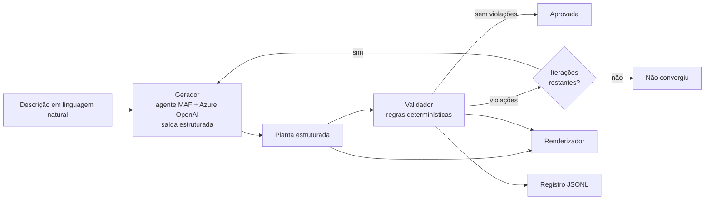
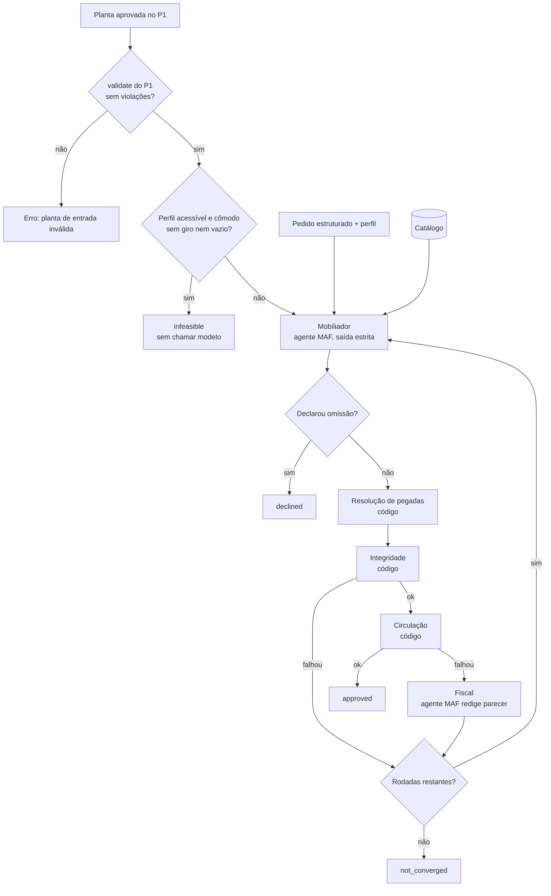

# floorplan-guardrails

A language model proposes the floor plan of a house from a description written
in plain Portuguese. A deterministic validator measures that proposal against
design rules and reports what is wrong. The report goes back to the model, which
redraws the plan, until it passes. The thesis is the separation: **generate with
a model, verify with code.**

[](https://github.com/yujikunitake/floorplan-guardrails/actions/workflows/lint.yml)
[](https://github.com/yujikunitake/floorplan-guardrails/actions/workflows/test.yml)
[](https://github.com/yujikunitake/floorplan-guardrails/releases)
[](LICENSE)

[](https://codespaces.new/yujikunitake/floorplan-guardrails)

## Propósito

Modelos de linguagem produzem respostas plausíveis, e plausível não é correto.
Quando a correção pode ser definida em código, ela não precisa ser aceita por
confiança: pode ser medida, e a medição pode voltar ao modelo como instrução.

A oficina demonstra esse argumento num caso em que a correção é inequívoca. Uma
planta ou tem cômodos sobrepostos, ou não tem; uma janela ou está sobre parede
externa, ou não está. Ao final, espera-se que o participante saiba distinguir o
que convém delegar a um modelo do que convém especificar em código, e reconheça
esse desenho, de gerar, verificar e devolver a verificação, como padrão
aplicável muito além de plantas baixas.

## A oficina

Projeto de extensão da PUCPR realizado na Estácio, em setembro de 2026, em
encontro presencial de duas horas. O botão acima abre o ambiente no navegador;
não há instalação.

São três níveis, no mesmo notebook. No primeiro, o participante descreve uma
casa em português e observa o laço operar. No segundo, usa descrições preparadas
para falhar, como um quarto pequeno demais, um banheiro sem janela ou um cômodo
sem porta, e lê o relatório de violações, que é o que interessa. No terceiro,
altera um valor em `config/rules.yaml` e repete a execução, constatando que quem
define o aceitável é o arquivo de regras, não o modelo.

O conteúdo está escrito em [`docs/oficina.md`](docs/oficina.md), que serve tanto
de revisão a quem participou quanto de leitura autônoma a quem não participou:
percorre o problema, as convenções de desenho, as quinze regras e um caso real
do começo ao fim, incluindo o que ele revela sobre os limites do método.

## Como funciona


```mermaid
flowchart LR
    D[Descrição em linguagem natural] --> G[Gerador<br/>agente MAF + Azure OpenAI<br/>saída estruturada]
    G --> P[Planta estruturada]
    P --> V[Validador<br/>regras determinísticas]
    V -->|sem violações| A[Aprovada]
    V -->|violações| F{Iterações<br/>restantes?}
    F -->|sim| G
    F -->|não| N[Não convergiu]
    P --> R[Renderizador]
    V --> R
    V --> L[Registro JSONL]
```

Uma peça generativa e quatro determinísticas. O laço permanece em Python comum,
fora do framework de agentes, para que fique visível onde termina a parte que
estima e começa a parte que verifica.

O gerador desconhece os valores das regras: suas instruções tratam apenas de
convenções de desenho, e a área mínima de um quarto jamais lhe é informada. Ele
a descobre lendo o relatório. A restrição é deliberada, porque sem ela a
primeira planta seria aprovada e não haveria o que demonstrar, e um teste falha
caso qualquer valor de `config/rules.yaml` alcance o prompt.

Em avaliação com 21 descrições e 84 execuções, a régua em uso aprovou 30 de 42
plantas em até quatro iterações, e 26 de 42 saíram com geometria correta já na
primeira tentativa. Nenhum desses números sustenta conclusão sozinho: repetir a
mesma descrição com a mesma régua muda o desfecho em uma de cada quatro vezes. A
tendência que sobrevive ao ruído é o tamanho da casa, não a clareza do pedido.
Plantas de até 7 cômodos aprovam em 89% das execuções, e de 8 em diante a taxa
cai para 29% ([relatório](docs/avaliacao.md)).

## A segunda oficina: mobiliário

Continuação do mesmo projeto de extensão da PUCPR, realizada na Estácio em
30/09/2026, também em encontro presencial de duas horas e no mesmo ambiente
aberto pelo botão acima. Ela parte de onde a primeira parou: a planta já foi
aprovada pelo validador, e agora é preciso pôr os móveis dentro dela.

Dois agentes dividem o trabalho. O **mobiliador** posiciona os móveis pedidos,
escolhidos de um catálogo com dimensões fixas. O **fiscal** redige o parecer em
português, citando a fonte de cada exigência. Entre os dois, o código mede a
integridade da proposta (cada móvel inteiro dentro do seu cômodo, nenhum sobre
outro, o pedido atendido) e a circulação (espaço livre diante de cada porta,
faixa de uso de cada móvel e, quando o morador usa cadeira de rodas, o giro
dentro do cômodo). O princípio estende o da primeira oficina: **o LLM escolhe e
explica; o código mede e decide.** O fiscal não consegue aprovar nem reprovar,
o mobiliador não consegue contestar o parecer, e nenhum dos dois recebe nas
instruções os valores de `config/furniture_rules.yaml`.

São três níveis, no notebook
[`notebooks/oficina-p2.ipynb`](notebooks/oficina-p2.ipynb). No primeiro, o
participante pede móveis para uma planta pronta e observa a proposta do
mobiliador. No segundo, lê o parecer do fiscal sobre uma disposição preparada
para falhar, com e sem cadeira de rodas, e confere de onde veio cada exigência.
No terceiro, acompanha a negociação inteira, em que o parecer volta ao
mobiliador até a proposta passar ou as rodadas acabarem, e altera um valor em
`config/furniture_rules.yaml` para ver a exigência mudar de lugar.

A negociação termina em um de quatro estados:

- `approved`: nenhuma verificação falhou;
- `declined`: o mobiliador declarou que algum móvel não cabe;
- `not_converged`: as rodadas acabaram e ainda havia violações;
- `infeasible`: com cadeira de rodas, algum cômodo não comporta o giro nem
  vazio. O código decide isso antes da primeira rodada, sem chamar modelo, e a
  planta precisa voltar à etapa de geração.


```mermaid
flowchart TD
    P[Planta aprovada no P1] --> V{validate do P1<br/>sem violações?}
    V -- não --> X[Erro: planta de entrada inválida]
    V -- sim --> G{Perfil acessível e cômodo<br/>sem giro nem vazio?}
    G -- sim --> IN[infeasible<br/>sem chamar modelo]
    G -- não --> M[Mobiliador<br/>agente MAF, saída estrita]
    R[Pedido estruturado + perfil] --> M
    C[(Catálogo)] --> M
    M --> O{Declarou omissão?}
    O -- sim --> D[declined]
    O -- não --> F[Resolução de pegadas<br/>código]
    F --> I1[Integridade<br/>código]
    I1 -- falhou --> L
    I1 -- ok --> I2[Circulação<br/>código]
    I2 -- ok --> A[approved]
    I2 -- falhou --> FI[Fiscal<br/>agente MAF redige parecer]
    FI --> L{Rodadas restantes?}
    L -- sim --> M
    L -- não --> N[not_converged]
```

Em 16 negociações medidas em 28/09/2026 com `gpt-5-mini`, o perfil padrão
aprovou 4 de 8 e o acessível nenhuma. O mobiliador seguiu ao pé da letra 57 de
66 sugestões do fiscal, e 30 dessas 57 voltaram a falhar na rodada seguinte
([relatório](docs/avaliacao-p2.md)). Duas repetições por combinação é pouco
para sustentar taxa, mas basta para o argumento: a sugestão do fiscal é uma
proposta, e só vale depois que o código mede de novo.

O conteúdo está escrito em [`docs/oficina-p2.md`](docs/oficina-p2.md), no
mesmo espírito do guia da primeira oficina. O que se observou durante a
construção e não virou mudança de código está em
[`docs/p2-diario.md`](docs/p2-diario.md).

## Escopo e limites

Casas térreas, cômodos retangulares alinhados aos eixos, portas e janelas, até
cerca de dez cômodos. Na segunda oficina, móveis retangulares de um catálogo
com medidas fixas, girados só de 90 em 90 graus; os limites dessa parte, como a
folha de porta e a rota acessível entre cômodos, estão no
[guia da segunda oficina](docs/oficina-p2.md#limites). Fora do escopo: mais de
um pavimento, estrutura, escadas, orientação solar, recuos do lote e desenho
técnico executivo.

Os valores normativos são **didáticos**. Curitiba não fixa áreas mínimas nem
frações de janela: o Decreto Municipal 2397/2023 deixa o dimensionamento dos
cômodos ao projetista. As larguras mínimas de sala, cozinha e banheiro vêm do
Anexo F da ABNT NBR 15575-1, que é informativo e que não foi lido no original,
porque a norma é paga; os demais números têm a ordem de grandeza certa e mais
nada. O campo `source` de cada regra, em `config/rules.yaml`, diz de onde veio
cada valor e até onde ele foi conferido. O cálculo de ventilação é uma
**simplificação**: área da janela multiplicada por um fator de abertura
configurável, 0,50 por padrão.

Uma ressalva para quem é de engenharia civil ou arquitetura: as regras daqui
servem para mostrar o método, não para conferir projeto. Projeto real segue a
NBR 15575 e as demais normas técnicas vigentes e a legislação do lugar da obra.

Material didático. **Não substitui projeto de profissional habilitado.**

## Desenvolvimento

```bash
uv sync --frozen
uv run ruff check && uv run ruff format --check
uv run pytest
```

Nenhum teste comunica-se com o modelo. A camada determinística é exercitada com
plantas construídas manualmente, uma correta e uma por regra violada
isoladamente, incluindo uma casa em L para a detecção de parede externa. O laço
roda contra um gerador simulado.

Para as chamadas ao Azure, copie `.env.example` para `.env`. A variável
`AZURE_OPENAI_API_VERSION` **não deve ser definida**: o caminho `/openai/v1`
recusa esse parâmetro. A avaliação roda com `uv run python -m eval.run`, e
`--limit` permite conferir antes da rodada completa.

Toda alteração entra por pull request com squash merge; a `main` não aceita push
direto. O título do pull request vira a mensagem do commit e segue Conventional
Commits com lista fechada de escopos, verificada na integração contínua.
