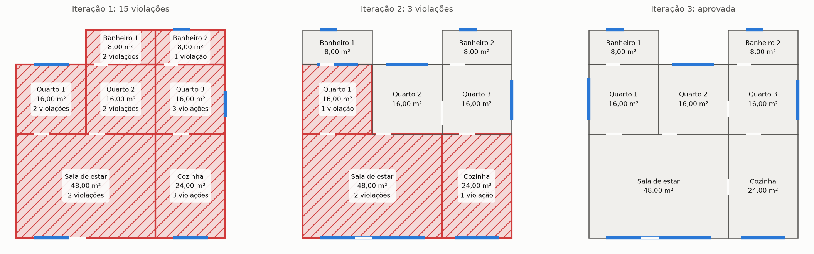

# Gerar com um modelo, verificar com código

Material de apoio da oficina. Serve a quem esteve presente, como revisão, e a
quem não esteve, como leitura autônoma: o texto não pressupõe o encontro.

## O problema

Um modelo de linguagem responde ao que se pede com algo plausível. Plausível
significa que a resposta se parece com uma resposta boa — não que ela seja
correta. A diferença costuma ser invisível quando o assunto é texto livre, e fica
evidente quando a resposta tem consequência verificável.

Diante disso há três caminhos. Confiar na resposta, o que só funciona enquanto
ninguém depende dela. Pedir a outro modelo que julgue, o que troca um juízo
incerto por dois. Ou escrever em código o que significa estar correto, medir a
resposta contra isso e devolver a medição ao modelo.

O terceiro caminho só está disponível quando a correção é definível. Nem sempre
está: não há função que decida se um poema é bom. Mas está disponível com muito
mais frequência do que se costuma supor, e esta oficina trabalha um caso em que
ela é inequívoca.

## Por que plantas baixas

Numa planta baixa, quase tudo que importa é geométrico e decidível:

- dois cômodos ou ocupam a mesma área, ou não ocupam;
- uma janela ou está inteiramente sobre parede externa, ou não está;
- uma porta entre dois cômodos ou fica sobre o trecho que eles dividem, ou não;
- todo cômodo ou é alcançável a partir da rua por portas, ou não é.

Nenhuma dessas perguntas precisa de opinião, e nenhuma precisa de outro modelo
para ser respondida. Bastam aritmética de intervalos e uma busca em grafo.

## Como a planta é representada

O modelo não devolve um desenho: devolve uma estrutura de dados, em metros com
duas casas decimais.

A origem fica no canto inferior esquerdo da casa; `x` cresce para leste e `y`
para norte. Cada cômodo é um retângulo alinhado aos eixos, descrito por `x` e `y`
(canto inferior esquerdo), `width` (extensão em x) e `depth` (extensão em y).

As quatro paredes se chamam `north` (em `y + depth`), `south` (em `y`), `east`
(em `x + width`) e `west` (em `x`). Portas e janelas são posicionadas por um
`offset` medido a partir do canto de **menor coordenada** daquela parede: do
oeste nas paredes norte e sul, do sul nas paredes leste e oeste. Uma parede de
quatro metros vai sempre do offset 0,00 ao 4,00, onde quer que o cômodo esteja.

Essa convenção é toda a linguagem comum entre o modelo e o verificador.

## O que o verificador mede

Catorze regras, em três grupos.

As de **integridade** perguntam se a planta fecha como desenho: dimensões
positivas, identificadores únicos, referências existentes, ausência de
sobreposição, aberturas que cabem na parede, janelas sobre parede externa, portas
sobre o trecho compartilhado.

As **funcionais** perguntam se dá para morar nela: todo cômodo tem porta, existe
uma porta para o exterior, e todo cômodo é alcançável a partir da rua percorrendo
apenas portas. Esta última é uma busca em grafo, e é a única que uma inspeção
visual distraída deixaria passar.

As **normativas** perguntam se ela atende a valores de projeto: área mínima,
menor dimensão, área de janela e área de ventilação, todas por tipo de cômodo.
Só estas leem números de um arquivo; as demais são fixas.

### Parede externa, e por que o retângulo envolvente não serve

Trecho externo é a parte da borda de um cômodo que **não encosta em nenhum outro
cômodo**. A definição parece rebuscada, e a alternativa ingênua — considerar
externa toda parede que toca o retângulo que envolve a casa — quebra no primeiro
caso interessante. Numa casa em L, o recorte faz com que existam paredes situadas
no interior do retângulo envolvente que, ainda assim, não têm vizinho algum.

O verificador calcula, para cada parede, a parede inteira menos tudo o que é
compartilhado. É subtração de intervalos, e nada mais.

## Um caso completo

A descrição foi: *"Uma casa em formato de L, com a sala e a cozinha numa ala e
três quartos e dois banheiros na outra."*

Cômodo em vermelho e hachurado é cômodo envolvido em alguma violação; o número
dentro dele diz quantas. Os traços azuis são janelas, e as falhas nas paredes são
portas.

**Primeira tentativa: 15 violações.** Três cômodos — a cozinha e dois dos quartos
e banheiros — ficaram inalcançáveis: o modelo desenhou os ambientes e esqueceu as
portas que os ligam ao resto da casa. O restante das violações é de iluminação e
ventilação, com janelas pequenas demais ou inexistentes.

> Não se chega ao cômodo "Cozinha" (r2) vindo da rua, passando só por portas.
> Falta uma porta ligando esse cômodo ao resto da casa.
>
> O cômodo "Quarto 2" (r6) tem 0,00 m² de janela, abaixo dos 2,67 m² exigidos
> para quartos desse tamanho.

**Segunda tentativa: 3 violações — e são de outra natureza.**

> A porta do cômodo "Sala de estar" (r1) vai de 6,50 m a 7,40 m, mas a parede
> leste tem 6,00 m. A abertura precisa caber na parede.
>
> A janela do cômodo "Quarto 1" (r4) na parede norte não está inteira sobre um
> trecho de parede externa.
>
> A porta do cômodo "Sala de estar" (r1) na parede leste leva ao cômodo "Cozinha"
> (r2), mas não está inteira sobre a parede que os dois dividem.

Observe o que aconteceu. Para corrigir as janelas, o modelo redimensionou
cômodos. Ao redimensioná-los, deslocou paredes. E ao deslocar paredes, quebrou
portas que antes estavam corretas — uma delas passou do fim da parede, outra
deixou de coincidir com o trecho compartilhado.

**Terceira tentativa: aprovada.**

## O que este caso ensina

**Corrigir uma coisa quebra outra.** É por isso que o laço pede a planta inteira
de volta a cada iteração, e não um remendo: mexer num cômodo desloca os vizinhos.
E é por isso que todas as catorze regras são executadas de novo a cada volta, e
não apenas as que falharam.

**O relatório é a interface.** O modelo nunca recebeu os números das regras. Ele
não sabe que um quarto precisa de 2,67 m² de janela; descobriu isso lendo a frase
que o verificador escreveu. As mensagens são redigidas para serem lidas por dois
públicos — quem corrige e quem aprende — e é essa redação que faz a correção
acontecer.

**O verificador mede apenas o que lhe ensinaram a medir.** Não existe regra sobre
o terreno, nem sobre fidelidade ao pedido. Uma planta que ignorasse metade da
descrição e fechasse em todas as catorze regras seria aprovada sem hesitação. Numa
avaliação com 21 descrições, as quatro deliberadamente contraditórias foram todas
aprovadas — não porque o modelo resolveu a contradição, mas porque nada nas regras
pergunta se a resposta corresponde à pergunta.

Esse é o limite honesto do método, e vale mais do que qualquer de suas virtudes:
**a verificação é tão boa quanto a especificação.** O que não estiver nas regras
não existe para o verificador.

## Executando por conta própria

O botão *Open in GitHub Codespaces*, no início do [README](../README.md), abre o
ambiente pronto no navegador. O notebook `notebooks/oficina.ipynb` roda de cima
para baixo e pede endpoint, deployment e chave do Azure na primeira célula.

Três exercícios, na ordem em que valem a pena:

1. Descreva uma casa e acompanhe o laço. Antes de olhar o resultado, tente prever
   quais regras vão falhar na primeira tentativa.
2. Escreva uma descrição feita para falhar e leia o relatório inteiro. Compare o
   que o modelo afirma em `design_notes` com o que o verificador mediu.
3. Altere um valor em `config/rules.yaml` — a área mínima de quarto, por exemplo —
   e repita a mesma descrição. O modelo é o mesmo; o aceitável é que mudou.

## Levando o padrão adiante

O desenho — gerar, verificar com código, devolver a verificação — não tem nada de
específico a plantas baixas. Ele se aplica sempre que a correção puder ser
escrita como função: um SQL que precisa executar, um JSON que precisa validar
contra um esquema, um texto que precisa citar apenas fontes existentes, um
cronograma em que nenhuma tarefa pode começar antes de sua dependência.

A pergunta útil diante de qualquer tarefa entregue a um modelo é sempre a mesma:
*o que, nesta resposta, eu conseguiria verificar sem opinar?* O que sobrar dessa
pergunta é o que convém deixar com o modelo.
